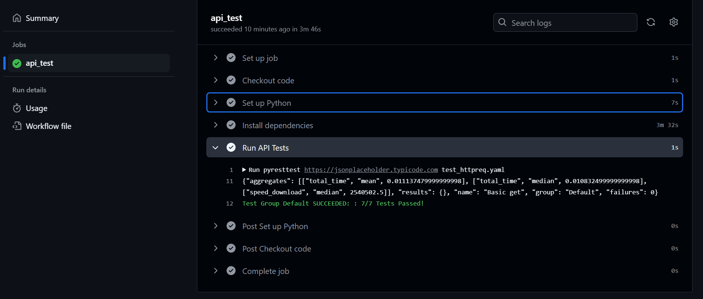

# Báo cáo Công cụ Kiểm thử Pyresttest

## Giới thiệu

Đây là báo cáo bài tập lớn môn **Kiểm thử và Đảm bảo chất lượng phần mềm**, với chủ đề **tìm hiểu công cụ Pyresttest** – một công cụ mã nguồn mở hỗ trợ kiểm thử tự động RESTful API thông qua các file cấu hình YAML hoặc JSON. Báo cáo cung cấp cái nhìn toàn diện từ lý thuyết đến thực hành, kèm theo các đánh giá và so sánh cụ thể.

## Nội dung chính

* Tổng quan về kiểm thử chức năng và RESTful API
* Giới thiệu, tính năng và cơ chế hoạt động của Pyresttest
* Cách viết kịch bản kiểm thử và thực thi kiểm thử
* Kiểm thử hiệu năng API với Pyresttest
* So sánh với các công cụ khác như Postman, Karate
* Ưu điểm và hạn chế của Pyresttest

## CI/CD với GitHub Actions
Dự án được tích hợp CI/CD pipeline bằng **GitHub Actions** để tự động chạy kiểm thử **Pyresttest** khi có commit hoặc pull request. Điều này giúp đảm bảo tính ổn định và chính xác của API qua mỗi lần cập nhật mã nguồn.

## Công nghệ và công cụ sử dụng

* Ngôn ngữ: Python 3.7
* Nền tảng: Ubuntu (thông qua WSL trên Windows)
* Công cụ: Pyresttest, YAML, PyCurl

